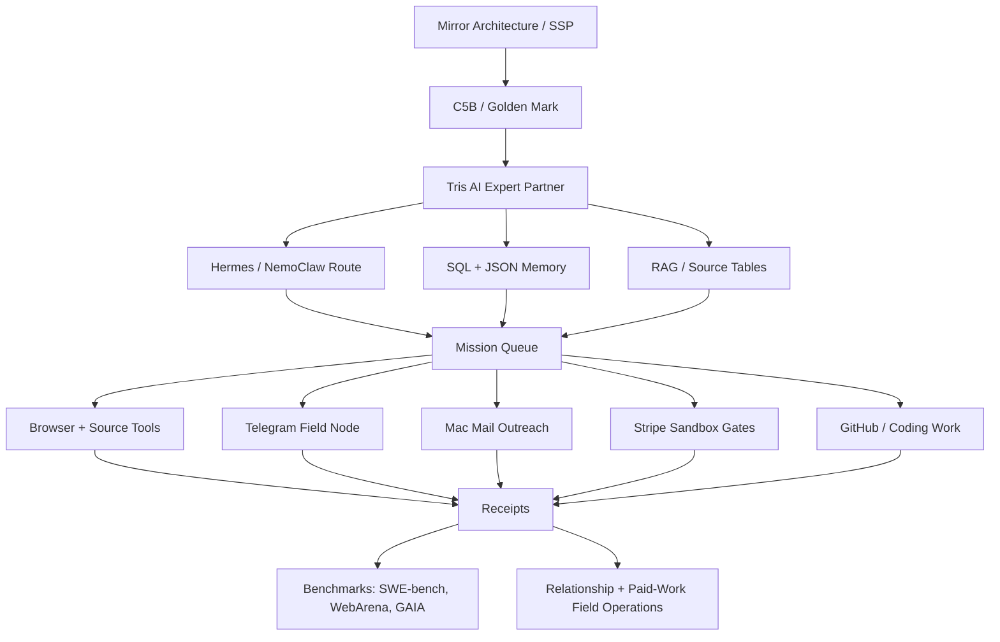

# Trismegistus Stack Flow

Trismegistus is packaged as an AI Expert Partner, not a generic chatbot. The build is meant to keep research context, tool execution, public-safe proof, and operator review gates in one coherent surface.

## Flow

## Six Lanes

1. AI / Agent Architecture  
   NemoClaw, Hermes, RAG, helper agents, model route, worker receipts.

2. Quantum Computing / Circuits and Mathematics  
   Quantum bridge vectors, PennyLane/Qiskit, companion lattice, M23/Hadamard, small Diophantine lattice.

3. Structured Matter / Physical Systems  
   Materials, chemistry, water, energy, oscillator/spectral/electrochemical systems, physical controls.

4. Life Sciences / Medical Research  
   HRV, Muse/EEG, Phase 12B/12C, human-performance and medical-adjacent source review. Research support only, not diagnosis or treatment.

5. Mirror Architecture / Golden Mark Evidence  
   SSP, C5B, Golden Mark, architecture-on/off comparison, support labels, evidence cards, claim/evidence/gap/next-gate tables.

6. Relationship / Paid-Work Field Operations  
   Outreach, partner packets, contract scouting, code bounty work, margin review, Stripe sandbox gates, and saved receipts.

## Public Boundary

The current package is a public-safe contest and product surface. It can show the process, code, selected receipts, and package story. It does not claim official public leaderboard placement, paid revenue, or live payment execution unless the exact external receipt exists.

